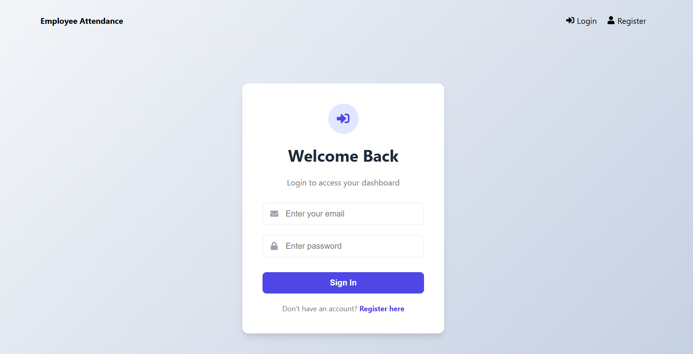
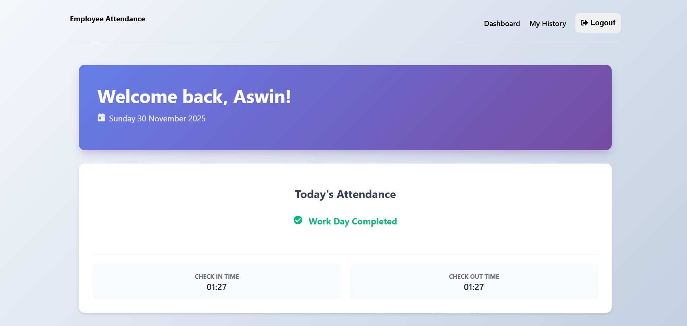
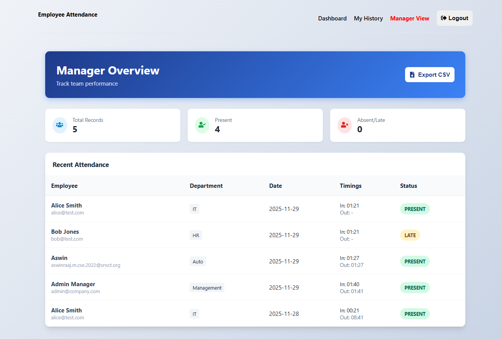

# 🚀 Employee Attendance System (MERN Stack)

A full-stack MERN application designed for efficient employee attendance tracking with secure authentication, real-time updates, and a dedicated Manager (Admin) view for team monitoring and attendance analytics.

---

## 📖 Table of Contents
- [Features](#-features)
- [Tech-Stack](#-tech-stack)
- [Screenshots](#-screenshots)
- [Installation-Guide](#-installation-guide)
- [Environment-Variables](#-environment-variables)
- [Login-Credentials](#-login-credentials)
- [API-Endpoints](#-api-endpoints)
- [Student-Details-Tap-Academy-Requirement](#-student-details-tap-academy-requirement)

---

## ✨ Features

### 👨‍💻 Employee Features
- 🔐 Secure Login & Registration with JWT  
- 🏠 Smart Dashboard with current date & greeting  
- ⏱ One-click “Check-In” and “Check-Out”  
- 📅 Real-time timestamp logging  
- 📘 Personal attendance history  
- 🟢🟡🔴 Status badges (Present / Late / Absent)

### 👮‍♂️ Manager (Admin) Features
- 👥 View attendance of all employees  
- 📊 Analytics: total employees, present, absent  
- 📁 Export full report to CSV  
- 🔍 Table with color-coded attendance status  
- 🏢 Team-level attendance monitoring

---

## 🛠 Tech Stack

| Layer | Technologies |
|-------|--------------|
| **Frontend** | React, Vite, Redux Toolkit, React-Toastify, Axios |
| **Backend** | Node.js, Express.js |
| **Database** | MongoDB Atlas, Mongoose |
| **Auth** | JWT, Bcrypt.js |

---

## 📸 Screenshots

| Login | Employee Dashboard |
|------|--------------------|
|  |  |

### Manager View  


---

## ⬇️ Installation Guide

### 1. Clone the Repository
```bash
git clone https://github.com/your-username/employee-attendance-system.git
cd employee-attendance-system
